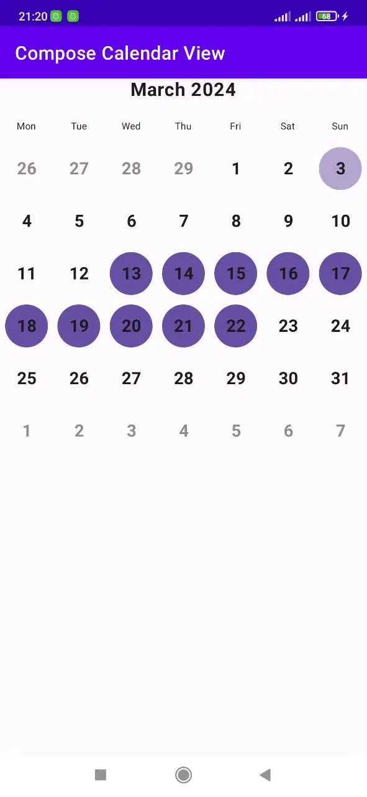
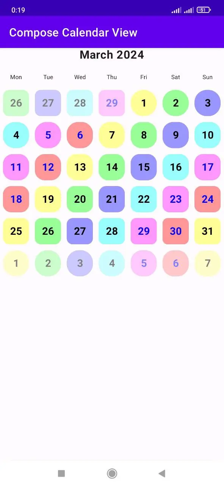

# Compose Calendar View

The repository hosts the open-source code of Android Compose Calendar library.

[](https://github.com/AndrewKuliahin96/compose-calendar-view/actions/workflows/lint.yml)

[](https://github.com/AndrewKuliahin96/compose-calendar-view/releases)


### Features

* 🌈 Customizable theme
* 📑 Based on Android Paging library
* 🧭 Horizontal and Vertical swipe direction
* 🎲 Single/multiple dates selection
* ⚡️ Static/dynamic weekdays
* 🈯️ Customizable locale
* 💠 Condition-based dates customization
* 📈 Single line mode - **Work in progress**
* 🌓 Dark mode - **Work in progress**
* 🎆 Calendar events - **Work in progress**

### System Requirements

* `compileSdk` API level 34
* `minSdk` API level 26 or higher

### Installation

Our [change log][changelog] has release history.

The latest release is available
on [Maven Central](https://search.maven.org/artifact/com.kuliahin/compose.calendar-view/0.0.3/jar).

```kotlin
implementation("com.kuliahin:compose.calendar-view:0.0.3")
```

### Docs and Guides

Coming soon

### Examples

<div style="display: flex; justify-content: space-between;">
  
  
</div>

License
-------

```
Copyright 2024 Andrii Kuliahin

Permission is hereby granted, free of charge, to any person obtaining a copy of this software and associated documentation files (the "Software"), to deal in the Software without restriction, including without limitation the rights to use, copy, modify, merge, publish, distribute, sublicense, and/or sell copies of the Software, and to permit persons to whom the Software is furnished to do so, subject to the following conditions:

The above copyright notice and this permission notice shall be included in all copies or substantial portions of the Software.

THE SOFTWARE IS PROVIDED "AS IS", WITHOUT WARRANTY OF ANY KIND, EXPRESS OR IMPLIED, INCLUDING BUT NOT LIMITED TO THE WARRANTIES OF MERCHANTABILITY, FITNESS FOR A PARTICULAR PURPOSE AND NONINFRINGEMENT. IN NO EVENT SHALL THE AUTHORS OR COPYRIGHT HOLDERS BE LIABLE FOR ANY CLAIM, DAMAGES OR OTHER LIABILITY, WHETHER IN AN ACTION OF CONTRACT, TORT OR OTHERWISE, ARISING FROM, OUT OF OR IN CONNECTION WITH THE SOFTWARE OR THE USE OR OTHER DEALINGS IN THE SOFTWARE.
```

[changelog]: https://github.com/AndrewKuliahin96/compose-calendar-view/releases

### Support me

[](https://www.buymeacoffee.com/andrewkuliahin)
